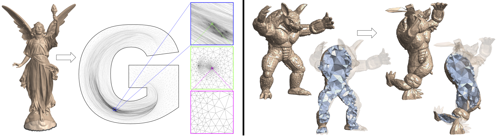
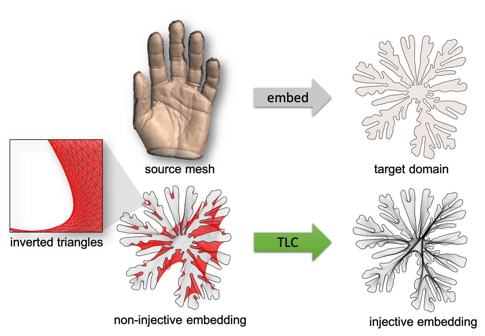

# Lifting Simplices to Find Injectivity

[Xingyi Du](https://duxingyi-charles.github.io/), [Noam Aigerman](https://research.adobe.com/person/noam-aigerman/), [Qingnan Zhou](https://research.adobe.com/person/qingnan-zhou/), [Shahar Kovalsky](https://shaharkov.github.io/), [Yajie Yan](https://yajieyan.github.io/), [Danny Kaufman](https://research.adobe.com/person/danny-kaufman/), [Tao Ju](https://www.cse.wustl.edu/~taoju/)
 *ACM Transaction on Graphics (Proceedings of SIGGRAPH 2020)* 

[`Project Page`](https://duxingyi-charles.github.io/publication/lifting-simplices-to-find-injectivity/)
[`Dataset`](https://github.com/duxingyi-charles/Locally-Injective-Mappings-Benchmark)

## Abstract

Mapping a source mesh into a target domain while preserving local injectivity is an important but highly non-trivial task. Existing methods either require an already-injective starting configuration, which is often not available, or rely on sophisticated solving schemes. We propose a novel energy form, called Total Lifted Content (**TLC**), that is equipped with theoretical properties desirable for injectivity optimization. By lifting the simplices of the mesh into a higher dimension and measuring their contents (2D area or 3D volume) there, **TLC** is smooth over the entire embedding space and its global minima are always injective. The energy is simple to minimize using standard gradient-based solvers. Our method achieved _100_% success rate on an extensive benchmark of embedding problems for triangular and tetrahedral meshes, on which existing methods only have varied success.

## TLC-QN

Here we release TLC-QN, a program that computes locally injective mapping by minimize TLC (Total Lifted Content) energy using quasi-Newton method.

The above figure illustrates **what TLC does**. It takes as input a source mesh and a non-injective initial embedding with inverted elements and outputs a locally injective embedding into the same target domain.

This program has been tested on macOS 10.15.5 (Apple Clang 11.0.3), Ubuntu 18.04.3 LTS (gcc 7.4.0) and Windows 10 (visual studio 2019).

There is a similar program [TLC-PN](https://github.com/duxingyi-charles/Total-Lifted-Content-PN) based on projected Newton method.

## Build

### Mac

We use [NLopt](https://nlopt.readthedocs.io/en/latest/) (version 2.6.1)'s L-BFGS quasi-Newton implementation.

The easiest way to build on Mac is to run the script, which installs NLopt using [homebrew](https://brew.sh/) and compiles the program.

    ./build_mac.sh

The program `findInjective` will be generated in the `build` subdirectory.

### Ubuntu

Use the following commands,

    sudo apt-get install libnlopt-dev
    mkdir build
    cd build
    cmake -DCMAKE_BUILD_TYPE=Release ..
    make

You may need to edit CMakeLists.txt to change NLopt paths to the proper directories on your machine.    

### Windows

Source code and DLLs of NLopt can be downloaded from the [official site](https://nlopt.readthedocs.io/en/latest/NLopt_on_Windows/).

To build the program, you can use CMake to generate a visual studio project from CMakeLists.txt.

## How to use

The executable `findInjective` asks for 3 arguments: path to an input data file, path to a solver options file, and path to the file to store the result.

    ./findInjective [input_file] [solver_options_file] [result_file]

An example is provided in the `example` subdirectory. Test it by:

    ./findInjective example/input example/solver_options example/my_result

The result will be written to `example/my_result`.

In the 3 arguments, `input_file` is mandatory, while the rest two are optional. If `solver_options_file` is not specified, `findInjective` will look for a file named `solver_options` in the same directory as the binary. If that file is not found, the program will fall back to default options. If `result_file` is not given, results will be written to a file named `result` in the directory of the binary.

## File format

### input_file

_Input file_ contains vertices and faces(triangles/tetrahedrons) information about the source mesh and initial embedding, as well as the indices of constrained vertices (usually boundary vertices).

    [num_sourceVert] [dimension_sourceVert]
    ... (num_sourceVert * dimension_sourceVert) Matrix ...
    [num_initVert]   [dimension_initVert]
    ... (num_initVert * dimension_initVert) Matrix ...
    [num_simplex]    [simplex_size]
    ... (num_simplex * simplex_size) Matrix ...
    [num_handles]
    ... (num_handles * 1) Matrix ...
 
 See `example/input` for a concrete example.
 
 **It's possible to use your own mesh formats.** We provide two python scripts in directory `IO` to convert common mesh formats to our `input_file` format.
 
 To use the two scripts, make sure to install [meshio](https://github.com/nschloe/meshio) with
 
     pip install meshio
 
 To convert triangle meshes to our input format, run
 
    ./convert_input_2D.py [inputObjFile] [handleFile] [outFile]
 
 Currently, we only support OBJ file with initial mesh as uv coordinates. Check out our [dataset](https://github.com/duxingyi-charles/Locally-Injective-Mappings-Benchmark) for some concrete OBJ and handle files.
 The generated `outFile` will have the format of our `input_file`.
 
 To convert tetrahedron rest(source) and initial meshes to our input format, run
 
    ./convert_input_3D.py [restFile] [initFile] [handleFile] [outFile]
 
 All tet-mesh formats supported by `meshio` should be handled by this script. We have tested the VTK format. For more examples in VTK format, please check out our [dataset](https://github.com/duxingyi-charles/Locally-Injective-Mappings-Benchmark).
    
 
### solver_options_file

_Solver options file_ contains parameters for TLC energy, options for NLopt solver, and a list of intermediate status to record during optimization.

    form
    [harmonic OR Tutte]
    alphaRatio
    [val]
    alpha
    [val]
    ftol_abs
    [val]
    ftol_rel
    [val]
    xtol_abs
    [val]
    xtol_rel
    [val]
    algorithm
    [LBFGS]
    maxeval
    [val]
    stopCode
    [none OR all_good]
    record
    vert    [0 OR 1]
    energy  [0 OR 1]
    minArea [0 OR 1]
   
|                | possible values  | default value | explanation                                                                                                                    |
|----------------|------------------|---------------|--------------------------------------------------------------------------------------------------------------------------------|
| form           | harmonic, Tutte  | Tutte         | two forms of TLC energy (see paper for details)                                                                                |
| alphaRatio     | [0, inf)         | 1e-6          | Specify the ratio of content (area or volume) between rest mesh and target domain. Default value 1e-6 is recommended.          |
| alpha          | (-inf, inf)      | 1e-6          | If negative, alpha will be computed from alphaRatio. If non-negative, alpha will overwrite the value computed from alphaRatio. |
| ftol_abs       | (-inf, inf)      | 1e-8          | Absolute energy change stop threshold. Negative value means disabled.                                                          |
| ftol_rel       | (-inf, inf)      | 1e-8          | Relative energy change stop threshold. Negative value means disabled.                                                          |
| xtol_abs       | (-inf, inf)      | 1e-8          | Absolute variable change stop threshold. Negative value means disabled.                                                        |
| xtol_rel       | (-inf, inf)      | 1e-8          | Relative variable change stop threshold. Negative value means disabled.                                                        |
| algorithm      | LBFGS            | LBFGS         | Quasi-Newton method.                                                                                                           |
| maxeval        | positive integer | 10000         | max number of iterations stop threshold.                                                                                        |
| stopCode       | none, all_good   | all_good      | Custom stop criteria. "all_good": optimization will stop when there are no inverted elements.                                   |
| record:vert    | 0, 1             | 0             | 1: record target mesh vertices at each iteration.                                                                              |
| record:energy  | 0, 1             | 0             | 1: record TLC energy at each iteration.                                                                                        |
| record:minArea | 0, 1             | 0             | 1: record smallest simplex signed content (area or volume) at each iteration.                                                  |
   
   See `example\solver_options` for a concrete example.
   
   

### result_file

_Result file_ stores the vertices of result mesh, and also intermediate records as specified in solver options file.

    
    name dims
    data
    ...

See `example\result` for a concrete example.

We provide a script to convert a `result_file` to a mesh file in directory `IO`.

Usage

    ./get_result_mesh.py [inputFile] [resultFile] [outFile]

For example, 

    ./get_result_mesh.py example/input example/result result.vtk

## Dataset

We release the large benchmark dataset of 2D/3D meshes used to compare with existing methods. The dataset includes _10743_ triangular mesh examples and _904_ tetrahedral mesh examples. The dataset is divided into 3 categories, 2D parameterization, 3D parameterization and 3D deformation. The dataset comes with both inputs and results of our method. Here is a more detailed [introduction and some examples](https://github.com/duxingyi-charles/Locally-Injective-Mappings-Benchmark).
